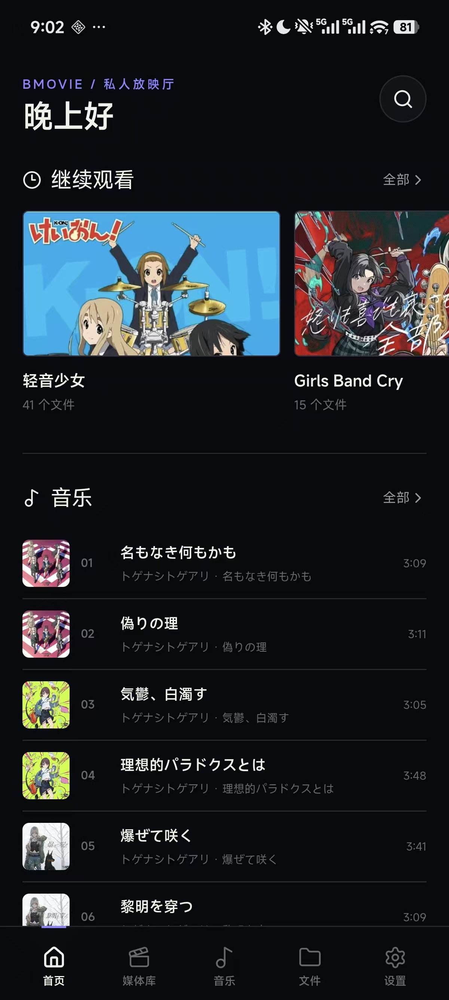
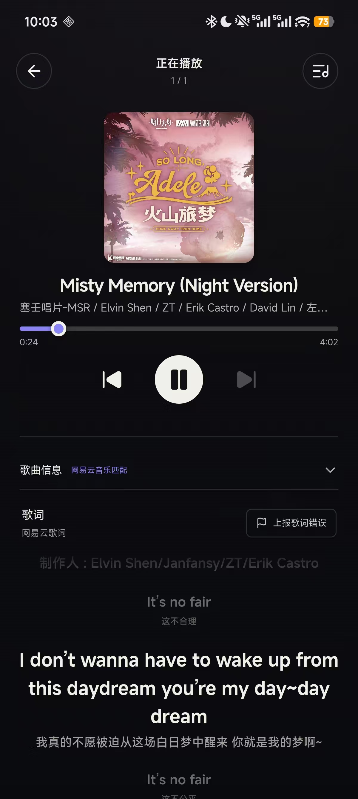
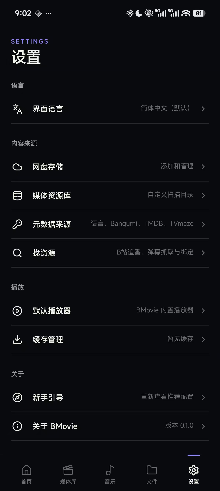
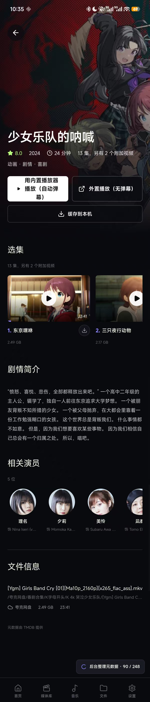
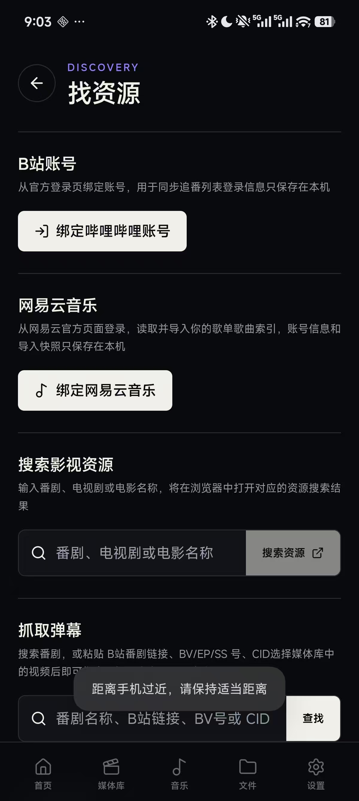
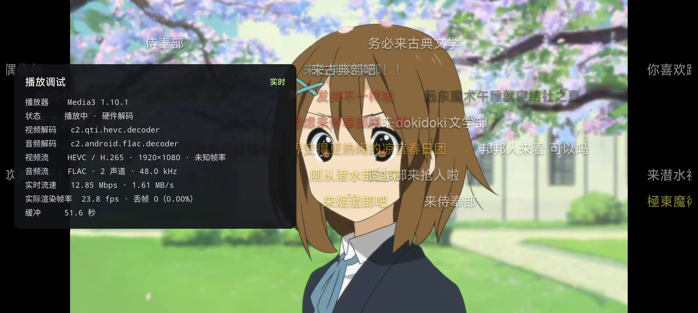

# BMovie

BMovie 是面向所有网盘用户的私人资源整合器

## 功能

- 内置Openlist 可连接绝大多数网盘类型
- 播放器元数据支持 字幕支持
- 播放器自动匹配B站弹幕
- 音乐/视频 多支持

## 推荐使用方式

- 强烈推荐配置TMDB数据库 提升使用舒适度很重要！！！
- 将种子用网盘保存 导入到软件内
- 网上找资源保存到网盘 导入到软件内


## 软件截图

<p align="center">
  
  
  
  
</p>

<p align="center">
  
</p>

<p align="center">
  
</p>

## 首次使用
- 软件首次打开有引导
1. 打开“设置 → 网盘存储”，添加网盘或本地存储
2. 打开“设置 → 媒体资源库”，选择需要建立索引的具体目录
3. 可选：在“设置 → 元数据来源”中配置 TMDB API Read Access Token
4. 可选：在“设置 → 找资源”中绑定 B站账号和网易云音乐账号

以上配置均不是首次启动的强制步骤，OpenList 管理员凭据由应用随机生成并保存在应用私有存储中，服务只监听设备回环地址

## 未来
- 将提供以AI驱动的资源自动搜索添加 (doing)
- 优化体验

## 开发

```powershell
pnpm install
pnpm dev
pnpm build
pnpm android:sync
pnpm android:run
```

Android 调试 APK 输出到：

```text
android/app/build/outputs/apk/debug/app-debug.apk
```

当前 APK 内置的 OpenList 二进制仅提供 `arm64-v8a` 架构


## CI

GitHub Actions 编译上传 仅arm64v8a （后续添加其他支持）


## 免责声明

- 该项目完全开源 使用api均来自网络搜索
- B站弹幕加载来自网络教程 非个人逆向获取
- 软件不用于任何盈利行为
